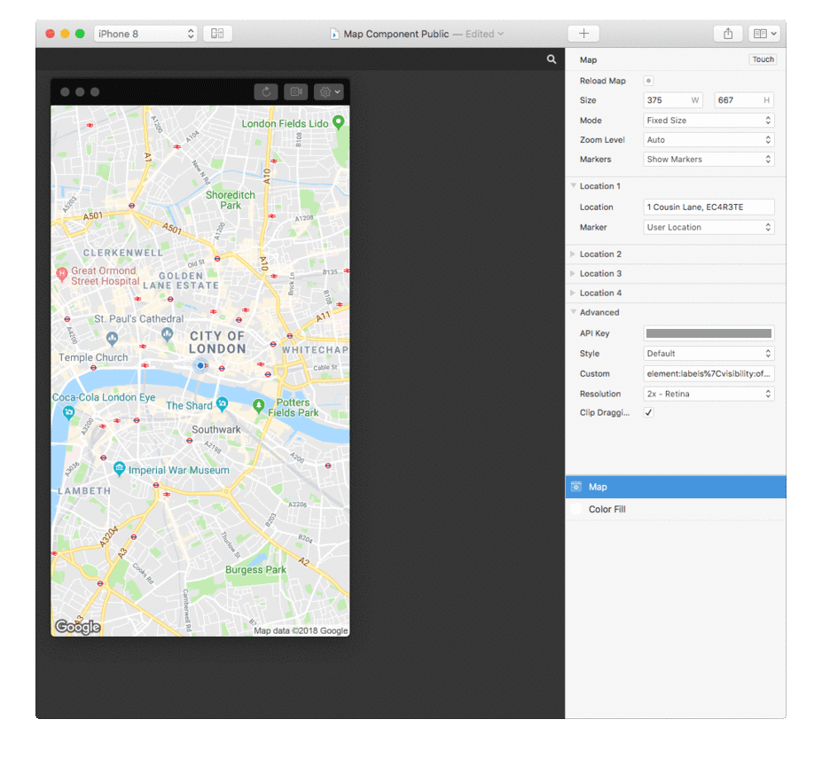

# origami-google-maps
Google Maps component for Origami

## How to use

**Getting started**
You'll need a Google Maps account to get started, available from https://cloud.google.com/maps-platform/pricing/?apis=maps. Once you've got an API key, just enter it in the `API Key` field.

**Updating the map**
To conserve API usage, the map is only reloaded `When Protoype Starts`, when you toggle between map modes, or when `Reload Map` is pulsed.

**Map modes**
You can choose between two modes: `Fixed` and `Draggable`. `Fixed` loads a map asset equal in size as the component itself. `Draggable` requests the max size possible map asset and enables dragging. Turn off `Clip Dragging` to allow for panning outside of map bounds.

**Custom Styles**
To create custom map styles, use http://mapstyle.withgoogle.com and copy everything between `&style=` and `&format` in the URL generated.

**Custom Marker Assets**
Enter the component and replace the respective marker URLs with encoded URLs to your desired assets

## To do

- Enable two-finger zoom and rotate
- Ability to define a separate center-point
- Double tap to go one zoom level down
- Display the travel path between locations
